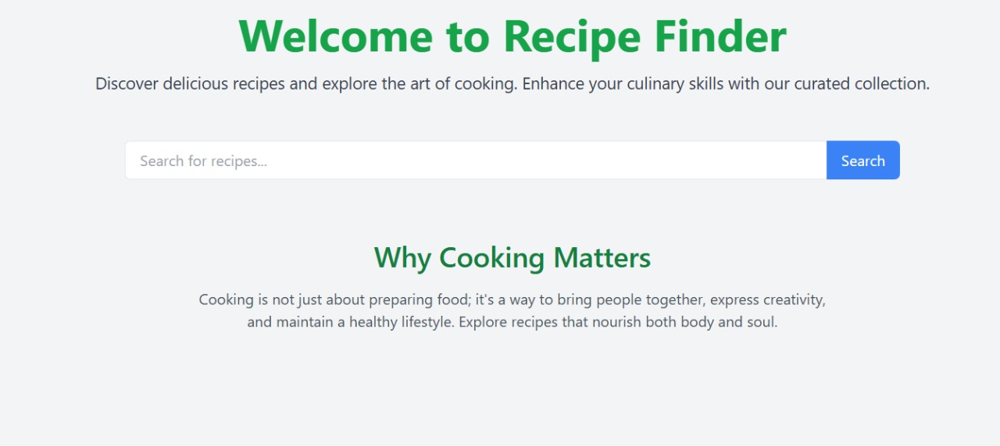
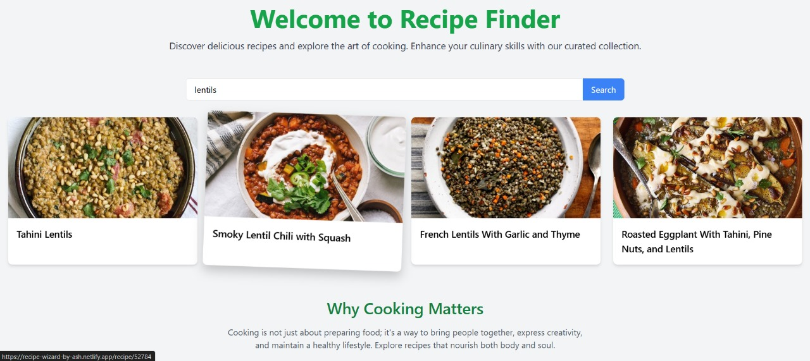
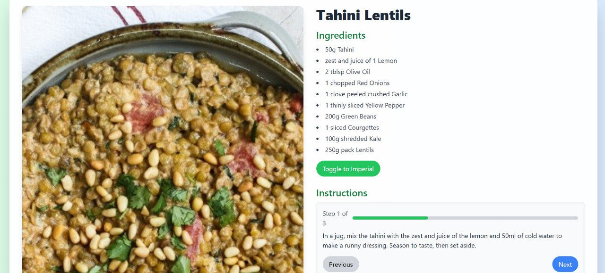
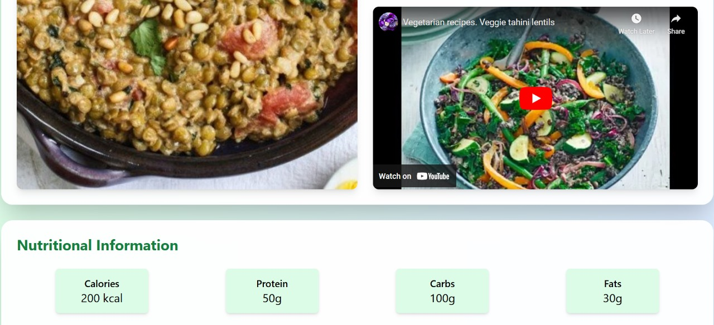

# Recipe Finder

## Introduction
Recipe Finder is a dynamic web application built with React.js that allows users to search for and discover a wide variety of recipes. Leveraging the TheMealDB API, the application provides detailed information about different meals, including ingredients, instructions, and nutritional information. Whether you're a cooking enthusiast or just looking for meal inspiration, Recipe Finder offers an intuitive and engaging user experience.

## Features

### 1. Search Functionality
Easily search for recipes by entering keywords related to the meal you're interested in.

### 2. Recipe Listings
View a list of recipes matching your search criteria, each displaying an image and name of the dish.

### 3. Detailed Recipe View
Click on any recipe to view comprehensive details, including ingredients, step-by-step instructions, and nutritional information.

### 4. Interactive UI
Enjoy smooth animations and transitions powered by Framer Motion for an enhanced user experience.

### 5. Responsive Design
Optimized for both desktop and mobile devices to provide a seamless experience across all platforms.

### 6. Favorites
Mark recipes as favorites for easy access later.

### 7. Video Tutorials
Watch video tutorials for selected recipes to guide you through the cooking process.

## Technologies Used

- **React.js**: Front-end library for building user interfaces.
- **Vite**: Fast build tool for development and production.
- **Tailwind CSS**: Utility-first CSS framework for styling.
- **Framer Motion**: Library for animations and transitions.
- **Axios**: Promise-based HTTP client for API requests.
- **React Router DOM**: Routing library for React applications.
- **Netlify**: Deployment and hosting platform.

## Usage

### Search for Recipes
Enter a keyword related to the recipe you're interested in using the search bar on the home page.

### View Recipe Listings
Browse through the list of recipes that match your search query. Each recipe card displays an image and the name of the dish.

### Explore Recipe Details
Click on a recipe card to view detailed information, including ingredients, instructions, nutritional information, and video tutorials.

### Manage Favorites
Mark recipes as favorites to easily access them later from the favorites section.

## Images

### Home Page


### Search Results


### Recipe Details


### Youtube Video


## Getting Started

To get started with the project, follow these steps:

1. Clone the repository:
    ```bash
    git clone https://github.com/yourusername/recipe-finder.git
    ```

2. Navigate to the project directory:
    ```bash
    cd recipe-finder
    ```

3. Install dependencies:
    ```bash
    npm install
    ```

4. Start the development server:
    ```bash
    npm start
    ```

5. Open your browser and navigate to `http://localhost:3000` to view the application.

## Contributing

We welcome contributions to the project. If you would like to contribute, please fork the repository and submit a pull request.

## Deployment

The application is deployed and can be accessed at [Recipe Finder](https://recipe-wizard-by-ash.netlify.app/).


